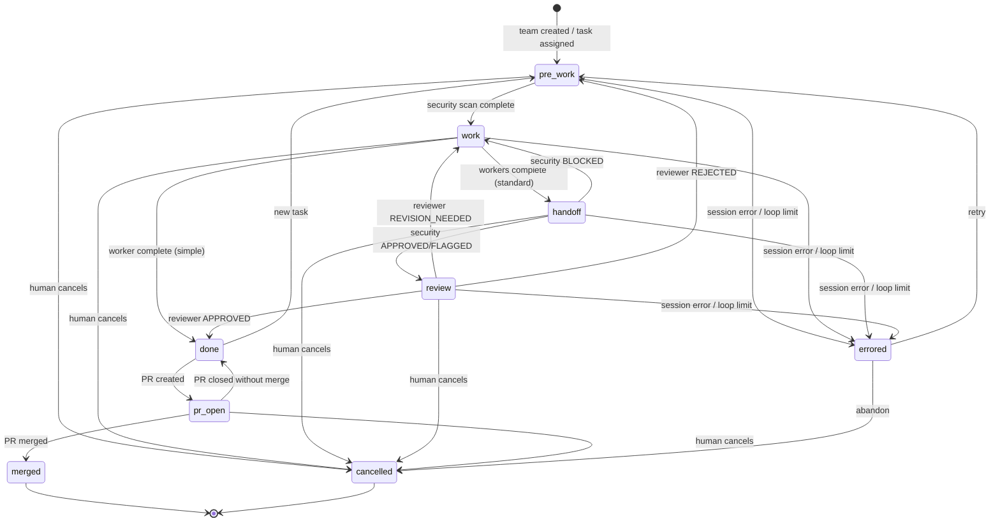

# ClaudeOrchestra - Workflow State Machine

> Source of truth for workflow states, transitions, loop limits,
> persistence, and error handling.
>
> Cross-references:
> - [Architecture](./architecture.md) - pipeline topology
> - [Operations](./operations.md) - health monitoring and shutdown

---

## State Diagram



The code source of truth is `src/state/team-state.ts`.

---

## Team Phase States

| State | Description |
|-------|-------------|
| `pre_work` | Security Agent scanning project and producing clearance |
| `work` | Worker-1 implementing and Worker-2 verifying requirements |
| `handoff` | Security Agent sweeping completed output |
| `review` | Reviewer evaluating security-cleared work |
| `done` | Task approved; sessions may stay alive for Q&A |
| `pr_open` | Pull request created and being polled for merge/close |
| `merged` | PR merged and team archived |
| `errored` | Unrecoverable failure requiring human intervention |
| `cancelled` | Task/team cancelled by human |

Terminal states in code are `done`, `merged`, `errored`, and `cancelled`. `done` can re-enter `pre_work` for a new task or move to `pr_open` when a PR is created.

---

## Pipeline Paths

### Simple Pipeline

For tasks classified as simple by the heuristic router or reclassified as SIMPLE by Security during pre-scan:

```text
work -> done
```

Only Worker-1 participates.

### Standard Pipeline

For tasks classified as standard or complex:

```text
pre_work -> work -> handoff -> review -> done
```

All four runtime agents participate: Security-1, Worker-1, Worker-2, Reviewer-1.

---

## Agent States

Each agent within a team has its own state independent of the team's phase.

| State | Description |
|-------|-------------|
| `spawning` | Runtime session initializing or ready to initialize |
| `active` | Processing a prompt or executing work |
| `idle` | Waiting for the pipeline to reach this agent's step |
| `blocked` | Cannot proceed without intervention |
| `waiting` | Awaiting a feedback response |
| `done` | Completed current work |
| `errored` | Session crashed or produced unrecoverable failure |

Valid agent transitions are enforced in `src/state/team-state.ts`.

---

## Phase Transitions

### PreWork -> Work

Trigger: Security scan completes, or the pipeline starts a simple task.

Engine actions:

- Parse `CLASSIFICATION: SIMPLE|STANDARD|COMPLEX`.
- If SIMPLE, close unused standard-pipeline sessions and run Worker-1 only.
- If STANDARD/COMPLEX, continue with all standard-pipeline agents.
- Persist state.

### Work -> Handoff

Trigger: Worker-1 implementation completes and Worker-2 verification completes or reaches the max verification passes.

Engine actions:

- Auto-commit `WIP: work phase complete`.
- Send post-work sweep prompt to Security.
- Persist state.

### Work -> Done

Trigger: Simple pipeline Worker-1 completes.

Engine actions:

- Auto-commit final task checkpoint.
- Mark pipeline complete.
- Emit `task-complete`.
- Keep session available for Q&A when possible.

### Handoff -> Review

Trigger: Security sweep verdict is `APPROVED` or `FLAGGED`.

Engine actions:

- Auto-commit `WIP: security sweep passed`.
- Send review prompt to Reviewer.
- Persist state.

### Handoff -> Work

Trigger: Security sweep verdict is `BLOCKED`.

Engine actions:

- Increment revision and total-backward-transition counters.
- Notify dashboard.
- Send updated constraints back through Work.

### Review -> Done

Trigger: Reviewer verdict is `APPROVED`.

Engine actions:

- Auto-commit final task checkpoint.
- Mark pipeline complete.
- Emit completion feedback and `task-complete`.

### Review -> Work

Trigger: Reviewer verdict is `REVISION_NEEDED`.

Engine actions:

- Increment revision and total-backward-transition counters.
- Notify dashboard.
- Re-run Worker-1 and Worker-2 with review feedback.

### Review -> PreWork

Trigger: Reviewer verdict is `REJECTED`.

Engine actions:

- Increment rejection and total-backward-transition counters.
- Notify dashboard.
- Restart from Security scan.

### Done -> PrOpen

Trigger: User creates a PR from the dashboard.

Engine actions:

- Push team branch.
- Create GitHub PR through `gh pr create`.
- Store `prNumber` and `prUrl`.
- Start PR polling.

### PrOpen -> Merged

Trigger: PR polling detects merged PR.

Engine actions:

- Close lingering sessions.
- Delete local team branch after checkout to `main`.
- Remove registry entry.
- Emit `team-archived`.

### PrOpen -> Done

Trigger: PR polling detects PR closed without merge.

Engine actions:

- Clear PR info.
- Return to `done`.
- Notify dashboard that a new PR can be created.

### Any Active Phase -> Errored

Triggered by:

- Provider session failure
- Loop limit exceeded
- Unhandled pipeline exception

Engine actions:

- Emit `error`.
- Notify dashboard.
- Transition to `errored`.
- Persist state.

### Any Active Phase -> Cancelled

Triggered by human cancellation or shutdown.

Engine actions:

- Close sessions.
- Transition to `cancelled` when valid.
- Persist state.

---

## Loop Limits

Revision and rejection loops are bounded to prevent infinite cycling.

| Limit | Default | Applies To |
|-------|---------|------------|
| `maxRevisions` | 3 | `handoff -> work`, `review -> work` |
| `maxRejections` | 2 | `review -> pre_work` |
| `maxTotalBackwardTransitions` | 5 | All backward phase transitions combined |

When a limit is exceeded, `TeamState.transitionPhase()` sets the team to `errored` and throws `TransitionError`.

### Verification Loop

Worker-2 verification has its own internal cap:

| Limit | Value | Scope |
|-------|-------|-------|
| `MAX_VERIFY_PASSES` | 2 | Worker-2 re-checks per Work phase entry |

This does not increment revision counters. After the cap is reached, the pipeline proceeds to Security sweep.

---

## State Persistence

Each team writes state to the target project:

```text
{project-root}/
└── .claude-orchestra/
    └── teams/
        └── {team-id}/
            └── state.json
```

Persisted fields include:

- Team identity and target project path
- Current phase
- Agent statuses
- Current task, complexity, and approved requirements
- Loop counters
- Branch name
- PR number and URL
- Timestamps

Persistence behavior:

- Phase transitions force immediate writes.
- Agent/task metadata writes are debounced.
- Writes are atomic via temp-file + rename.
- `.claude-orchestra/` is automatically added to the target project's `.gitignore`.
