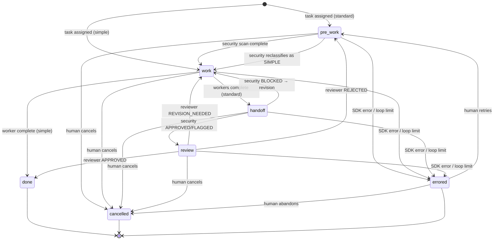

# ClaudeOrchestra — Workflow State Machine

> Source of truth for all workflow states, transitions,
> preconditions, loop limits, and error handling.
>
> **Cross-references:**
> - [Architecture](./architecture.md) — pipeline topology
> - [Operations](./operations.md) — health monitoring,
>   shutdown protocol

---

## State Diagram



---

## Team Phase States

| State | Description |
|-------|-------------|
| `pre_work` | Security Agent scanning project, producing clearance report |
| `work` | Worker-1 implementing, Worker-2 verifying requirements |
| `handoff` | Security Agent sweeping completed output |
| `review` | Reviewer evaluating security-cleared work |
| `done` | Task approved, sessions kept alive for Q&A |
| `errored` | Unrecoverable failure, requires human intervention |
| `cancelled` | Task cancelled by human orchestrator |

### Terminal States

`done`, `cancelled`, and `errored` (if not retried) are
terminal states. When a team reaches a terminal state:

1. Final `state.json` is persisted
2. Agent sessions are kept alive (done) or closed (errored/
   cancelled)
3. Team is marked inactive in the orchestrator

---

## Two Pipeline Paths

### Simple Pipeline

For tasks classified as simple by the heuristic router or
reclassified as SIMPLE by Security during pre-scan:

```
Work → Done
```

Only Worker-1 participates. No Security sweep, no Review.

### Standard Pipeline

For tasks classified as standard or complex:

```
PreWork → Work → Handoff → Review → Done
```

All 4 agents participate. Supports backward transitions.

---

## Agent States

Each agent within a team has its own state, independent of
the team's phase state.

| State | Description |
|-------|-------------|
| `Spawning` | SDK session initializing |
| `Active` | Processing a prompt or executing work |
| `Idle` | Waiting for the pipeline to reach this agent's step |
| `Blocked` | Cannot proceed (loop limit, SDK error) |
| `Waiting` | Awaiting a response (used for blocking feedback) |
| `Done` | Completed current work |
| `Errored` | Session crashed or produced invalid output |

### Valid Agent State Transitions

```
Spawning → Active | Errored
Active   → Idle | Blocked | Waiting | Done | Errored
Idle     → Active | Errored
Blocked  → Active (when unblocked) | Errored
Waiting  → Active (when response received) | Errored
Done     → Active (next step) | Idle
Errored  → Spawning (session recreated)
```

---

## Phase Transitions

### PreWork → Work

**Trigger:** Security Agent's scan response is parsed.

**Engine actions:**
- Parse classification (SIMPLE/STANDARD/COMPLEX)
- If SIMPLE: downgrade to simple pipeline, close unused
  sessions, skip to Work → Done
- If STANDARD/COMPLEX: proceed to Work with all agents
- Update team phase to `work`

### Work → Handoff (Standard Pipeline)

**Trigger:** Worker-1 completes implementation AND Worker-2
completes verification (or max verify passes reached).

**Engine actions:**
- Auto-commit: `WIP: work phase complete`
- Update team phase to `handoff`
- Send sweep request to Security with worker summaries

### Work → Done (Simple Pipeline)

**Trigger:** Worker-1 completes implementation.

**Engine actions:**
- Update team phase to `done`
- Emit `task-complete` event

### Handoff → Review (Security Approved)

**Trigger:** Security Agent responds with `APPROVED` or
`FLAGGED` verdict.

**Engine actions:**
- Auto-commit: `WIP: security sweep passed`
- Update team phase to `review`
- Send review request to Reviewer with task context and
  worker summaries

### Handoff → Work (Security Blocked)

**Trigger:** Security Agent responds with `BLOCKED` verdict.

**Engine actions:**
- Increment revision loop counter (auto, via state machine)
- Check against max loop limits (throws if exceeded)
- Update team phase to `work`
- Notify dashboard (non-blocking warning)
- Re-run Worker-1 with updated constraints, then Worker-2

### Review → Done (Approved)

**Trigger:** Reviewer responds with `APPROVED` verdict.

**Engine actions:**
- Auto-commit with task description (first 72 chars)
- Update team phase to `done`
- Keep sessions alive for Q&A
- Emit `task-complete` event

### Review → Work (Revision Needed)

**Trigger:** Reviewer responds with `REVISION_NEEDED` verdict.

**Engine actions:**
- Increment revision loop counter
- Check against max loop limits
- Update team phase to `work`
- Notify dashboard (non-blocking info)
- Re-run Worker-1 with reviewer feedback, then Worker-2

### Review → PreWork (Rejected)

**Trigger:** Reviewer responds with `REJECTED` verdict.

**Engine actions:**
- Increment rejection counter
- Check against max rejection limit
- Update team phase to `pre_work`
- Notify dashboard (non-blocking warning)
- Restart pipeline from Security scan

### Any Phase → Errored

**Triggered by:**
- SDK `query()` rejects (session crash)
- Loop limit exceeded (`TransitionError` thrown)
- Unhandled exception in pipeline

**Engine actions:**
- Update team phase to `errored`
- Close all agent sessions
- Emit `error` event for dashboard
- Surface to human as critical notification

### Any Phase → Cancelled

**Triggered by:** Human orchestrator cancels via dashboard.

**Engine actions:**
- Update team phase to `cancelled`
- Close all agent sessions
- Persist final state

---

## Loop Limits

Revision and rejection loops are bounded to prevent infinite
cycling. The state machine enforces these automatically.

### Revision Loop (Handoff → Work or Review → Work)

- **Default maximum:** 3 revisions per task
- **Counter:** Incremented automatically by `transitionPhase()`
  on backward transitions to Work
- **At limit:** `TransitionError` thrown, pipeline catches it
  and transitions to `errored`
- **Configurable:** Via `maxRevisions` in loop limits config

### Rejection Loop (Review → PreWork)

- **Default maximum:** 2 rejections per task
- **Counter:** Incremented automatically on backward
  transitions to PreWork
- **At limit:** Same as revision — `TransitionError` → errored

### Combined Limit

- **Total backward transitions:** 5 per task (revisions +
  rejections combined)
- **Purpose:** Catches pathological patterns where the task
  oscillates between different failure modes
- **At limit:** Same as individual limits

### Verification Loop (Worker-2 re-checks)

- **Maximum:** 2 passes per Work phase entry
- **Scope:** Internal to the Work phase, does NOT increment
  the revision counter
- **At limit:** Proceeds to Security sweep regardless of
  Worker-2's verdict

### Default Loop Limits

```typescript
{
  maxRevisions: 3,
  maxRejections: 2,
  maxTotalBackwardTransitions: 5,
  maxVerifyPasses: 2   // per Work phase entry
}
```

---

## State Persistence

### What Is Persisted

The `state.json` file for each team captures:

```json
{
  "teamId": "team-uuid",
  "teamName": "my-project",
  "projectPath": "/path/to/project",
  "currentPhase": "work",
  "complexity": "standard",
  "agents": {
    "Worker-1": {
      "role": "Worker",
      "state": "Active",
      "pid": null
    },
    "Worker-2": {
      "role": "Worker",
      "state": "Active",
      "pid": null
    },
    "Security-1": {
      "role": "Security",
      "state": "Done",
      "pid": null
    },
    "Reviewer-1": {
      "role": "Reviewer",
      "state": "Idle",
      "pid": null
    }
  },
  "currentTask": {
    "description": "Add user authentication with JWT",
    "complexity": "standard",
    "requirements": "...",
    "assignedAt": "ISO-8601"
  },
  "counters": {
    "revisions": 0,
    "rejections": 0,
    "totalBackwardTransitions": 0
  },
  "createdAt": "ISO-8601",
  "updatedAt": "ISO-8601"
}
```

### Persistence Strategy

- **Forced writes on phase transitions** — every phase change
  triggers an immediate `state.json` write.
- **Atomic writes** — temp file + rename pattern for
  crash safety.
- **Debounced writes** — agent state changes are batched
  (at most once per second) except during transitions.

### Runtime Data Structure

```
{project-root}/
├── .claude-orchestra/
│   └── teams/{team-id}/
│       ├── state.json
│       └── (future: reports, logs)
```

The `.claude-orchestra/` directory is added to `.gitignore`
automatically. Runtime data lives in the target project,
NOT in the engine repo. The engine repo maintains only a
`registry.json` mapping team IDs to project paths.
