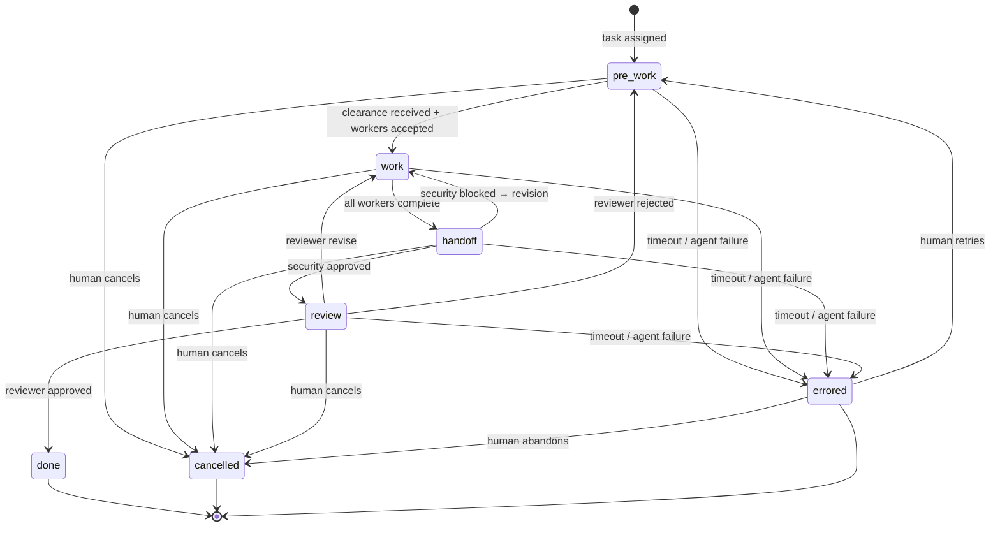

# ClaudeOrchestra — Workflow State Machine

> Source of truth for all workflow states, transitions,
> preconditions, timeouts, loop limits, error handling,
> cancellation, and deadlock detection.
>
> **Cross-references:**
> - [Message Contract](./message-contract.md) — transitions
>   are triggered by messages
> - [Operations](./operations.md) — timeout values, health
>   check integration

---

## State Diagram



---

## Team Phase States

| State | Description |
|-------|-------------|
| `pre_work` | Supervisor received task, Security scanning, planning in progress |
| `work` | Workers executing, Supervisor directing |
| `handoff` | Workers done, Security sweeping completed output |
| `review` | Reviewer evaluating security-cleared work |
| `done` | Task approved by Reviewer, all agents idle |
| `errored` | Unrecoverable failure, requires human intervention |
| `cancelled` | Task cancelled by human orchestrator |

### Terminal States

`done`, `cancelled`, and `errored` (if not retried) are
terminal states. When a team reaches a terminal state:

1. All agent processes are sent a termination signal
   (see [Operations — Graceful Shutdown](./operations.md#graceful-shutdown-protocol))
2. Final `state.json` is persisted
3. Message bus inboxes are archived (not deleted)
4. Team is marked inactive in the orchestrator

---

## Agent States

Each agent within a team has its own state, independent of
the team's phase state.

| State | Description |
|-------|-------------|
| `spawning` | CLI process starting up |
| `active` | Executing work or processing messages |
| `idle` | Waiting for work (role not needed in current phase) |
| `blocked` | Cannot proceed, waiting on another agent or human |
| `waiting` | Sent a message with `requiresResponse: true`, awaiting reply |
| `done` | Completed current phase's work |
| `errored` | Process crashed, output malformed, or timeout exceeded |

### Valid Agent State Transitions

```
spawning → active | errored
active   → idle | blocked | waiting | done | errored
idle     → active | errored
blocked  → active (when unblocked) | errored
waiting  → active (when response received) | errored (timeout)
done     → active (next phase begins) | idle
errored  → spawning (respawn attempt)
```

---

## Phase Transitions

### Pre-Work → Work

**Preconditions (ALL must be true):**
1. Security Agent has sent `clearance-report` to Supervisor
2. Supervisor has sent `task-assignment` to all Workers
3. All Workers have sent `task-accepted` to Supervisor

**Triggered by:** Last Worker's `task-accepted` message
processed.

**Engine actions on transition:**
- Update team phase to `work`
- Set Worker states to `active`
- Log phase transition event

### Work → Handoff

**Preconditions (ALL must be true):**
1. All Workers have sent `task-complete` to Supervisor
2. No Workers are in `blocked` state

**Triggered by:** Last Worker's `task-complete` message
processed.

**Engine actions on transition:**
- Update team phase to `handoff`
- Set Worker states to `done`
- Supervisor sends `sweep-request` to Security Agent
- Set Security Agent state to `active`

### Handoff → Review (Security Approved)

**Preconditions:**
1. Security Agent has sent `handoff-clearance` with verdict
   `APPROVED` or `FLAGGED`

**Triggered by:** `handoff-clearance` message with approved/
flagged verdict.

**Engine actions on transition:**
- Update team phase to `review`
- Set Security Agent state to `done`
- Supervisor sends `review-request` to Reviewer
- Set Reviewer state to `active`

### Handoff → Work (Security Blocked)

**Preconditions:**
1. Security Agent has sent `handoff-clearance` with verdict
   `BLOCKED`
2. Revision loop count has not exceeded maximum

**Triggered by:** `handoff-clearance` message with blocked
verdict.

**Engine actions on transition:**
- Increment revision loop counter
- Check against max loop limit (see Loop Limits)
- Update team phase to `work`
- Supervisor sends `revision-request` to affected Workers
  with Security's feedback
- Set Worker states to `active`
- Set Security Agent state to `idle`

### Review → Done (Approved)

**Preconditions:**
1. Reviewer has sent `review-approved` to Supervisor

**Triggered by:** `review-approved` message.

**Engine actions on transition:**
- Update team phase to `done`
- Set all agent states to `done`
- Persist final state
- Initiate graceful shutdown of all agent processes

### Review → Work (Revise)

**Preconditions:**
1. Reviewer has sent `review-revise` to Supervisor
2. Revision loop count has not exceeded maximum

**Triggered by:** `review-revise` message.

**Engine actions on transition:**
- Increment revision loop counter
- Check against max loop limit
- Update team phase to `work`
- Supervisor routes Reviewer feedback to appropriate Workers
  via `revision-request`
- Set Worker states to `active`
- Set Reviewer state to `idle`

### Review → Pre-Work (Rejected)

**Preconditions:**
1. Reviewer has sent `review-rejected` to Supervisor
2. Rejection count has not exceeded maximum

**Triggered by:** `review-rejected` message.

**Engine actions on transition:**
- Increment rejection counter
- Check against max rejection limit
- Update team phase to `pre_work`
- Supervisor re-plans from scratch
- Workers receive new assignments
- Security Agent re-scans

### Any Phase → Errored

**Triggered by:**
- Timeout exceeded (see Timeouts below)
- Agent retry count exceeded (3 consecutive malformed outputs)
- Agent process crash with no remaining respawn attempts
- Deadlock detected (see Deadlock Detection)

**Engine actions on transition:**
- Update team phase to `errored`
- Log the error with full context
- Surface to human orchestrator as `critical` priority
- Do NOT terminate agent processes — human may want to
  inspect the state

### Any Phase → Cancelled

**Triggered by:** Human orchestrator cancels via dashboard
or CLI command.

**Engine actions on transition:**
- Update team phase to `cancelled`
- Send termination signal to all agent processes
- Persist final state
- Archive all messages

---

## Timeouts

All timeouts are configurable. Defaults are provided below.

### Per-Message Timeouts

These apply to messages with `requiresResponse: true`.

| Message Flag | Default Timeout | Escalation |
|-------------|----------------|------------|
| `scan-request` | 5 minutes | Supervisor notified, then human at 10 min |
| `task-assignment` | 3 minutes | Supervisor notified (Worker not responding) |
| `clearance-request` | 3 minutes | Worker blocked, Supervisor notified |
| `sweep-request` | 5 minutes | Supervisor notified, then human at 10 min |
| `review-request` | 10 minutes | Supervisor notified, then human at 15 min |
| `check-in` | 2 minutes | Agent marked as potentially unhealthy |
| All other `requiresResponse: true` | 3 minutes | Supervisor notified |

### Per-Phase Timeouts

These are hard limits on how long a team can remain in a phase.

| Phase | Default Timeout | Escalation |
|-------|----------------|------------|
| `pre_work` | 15 minutes | Human notified, then `errored` at 20 min |
| `work` | 60 minutes | Human notified, then `errored` at 90 min |
| `handoff` | 10 minutes | Human notified, then `errored` at 15 min |
| `review` | 15 minutes | Human notified, then `errored` at 20 min |

### Timeout Escalation Protocol

1. **Warning** — at the default timeout, log a warning and
   surface to the human orchestrator as `high` priority.
2. **Critical** — at 1.5x the default timeout, surface as
   `critical` priority.
3. **Error** — at 2x the default timeout, transition the
   team to `errored` state.

The human can extend a timeout via the dashboard by
acknowledging the warning (resets the timer for another full
cycle).

### Silence Detection

Independent of message timeouts, the engine monitors each
agent for "silence" — no messages sent or received within a
configurable window:

| Role | Silence Threshold | Action |
|------|------------------|--------|
| Worker (during work phase) | 5 minutes | Supervisor sends `check-in` |
| Security Agent (during scan/sweep) | 3 minutes | Log warning |
| All agents | 10 minutes | Agent health check triggered |

---

## Loop Limits

Revision and rejection loops are bounded to prevent infinite
cycling.

### Revision Loop (Handoff → Work or Review → Work)

- **Default maximum:** 3 revisions per task
- **Counter:** Incremented each time the team transitions
  from `handoff` → `work` or `review` → `work`
- **At limit:** Team transitions to `errored` with message:
  "Maximum revision count (3) exceeded. Escalating to human."
- **Configurable:** Via `maxRevisions` in team configuration

### Rejection Loop (Review → Pre-Work)

- **Default maximum:** 2 rejections per task
- **Counter:** Incremented each time the team transitions
  from `review` → `pre_work`
- **At limit:** Team transitions to `errored` with message:
  "Maximum rejection count (2) exceeded. Escalating to human."
- **Configurable:** Via `maxRejections` in team configuration

### Combined Limit

- **Total loop budget:** 5 total backward transitions per
  task (revisions + rejections combined)
- **Purpose:** Even if individual limits aren't hit, the
  combined limit catches pathological patterns where the task
  oscillates between different failure modes.
- **At limit:** Same as individual — transition to `errored`.

---

## Deadlock Detection

A deadlock occurs when no agent can make progress because
each is waiting on another.

### Definition

The system is deadlocked when ALL of these are true:
1. No agent in the team is in `active` state
2. At least one agent is in `waiting` or `blocked` state
3. No messages with `status: pending` exist in any inbox
   (nothing to process)
4. No timeout has expired (which would break the deadlock
   via escalation)

### Detection Mechanism

The orchestrator's `tick()` loop checks for deadlock on every
iteration:

```
function isDeadlocked(team: TeamState): boolean {
  const hasActiveAgent = team.agents.some(
    a => a.state === 'active'
  );
  const hasWaitingAgent = team.agents.some(
    a => a.state === 'waiting' || a.state === 'blocked'
  );
  const hasPendingMessages = messageBus.getPending(
    team.teamId
  ).length > 0;

  return !hasActiveAgent && hasWaitingAgent && !hasPendingMessages;
}
```

### Resolution

1. Log the deadlock with all agent states and last messages.
2. Surface to human orchestrator as `critical` priority.
3. If the deadlock persists for 2 consecutive `tick()` cycles
   (to avoid false positives from timing), transition to
   `errored`.

The human can resolve by:
- Manually sending a message to unblock an agent
- Cancelling the task
- Restarting the phase

---

## State Persistence

### What Is Persisted

The `state.json` file for each team captures:

```json
{
  "teamId": "team-uuid",
  "teamName": "my-project",
  "projectPath": "/path/to/project",
  "currentPhase": "work",
  "agents": {
    "Supervisor-1": {
      "role": "Supervisor",
      "state": "active",
      "currentJob": "Monitoring worker progress",
      "lastMessageAt": "ISO-8601",
      "pid": 12345
    },
    "Worker-1": { "..." : "..." },
    "Worker-2": { "..." : "..." },
    "Security-1": { "..." : "..." },
    "Reviewer-1": { "..." : "..." }
  },
  "currentTask": {
    "description": "Add user authentication with JWT",
    "assignedAt": "ISO-8601"
  },
  "counters": {
    "revisions": 0,
    "rejections": 0,
    "totalBackwardTransitions": 0
  },
  "createdAt": "ISO-8601",
  "updatedAt": "ISO-8601"
}
```

### Persistence Strategy

- **Debounced writes:** State changes are batched. Writes
  occur at most once per second (configurable).
- **Forced writes:** Phase transitions always force an
  immediate write (not debounced) because phase state is
  critical for recovery.
- **Atomic writes:** Same temp file + rename pattern as
  the message bus (see
  [Message Contract — Atomic Writes](./message-contract.md#atomic-writes)).

### What Survives a Crash

| Data | Survives? | How |
|------|-----------|-----|
| Team phase | Yes | Persisted in `state.json` on every transition |
| Agent states | Partially | Last persisted snapshot (may be up to 1s stale) |
| Messages in inboxes | Yes | Each is a separate file on disk |
| Messages in transit | No | Partially written messages are cleaned up on restart |
| Loop counters | Yes | Persisted in `state.json` |
| Agent PIDs | Stale | PIDs from crashed processes, used for cleanup on restart |

### Recovery on Startup

When the engine starts and finds existing team data:

1. Read `state.json` to recover team phase and counters.
2. Scan inbox directories to reconstruct pending messages.
3. Clean up orphaned temp files (`.tmp-*`).
4. Check if agent PIDs from `state.json` are still alive:
   - If alive: reconnect (agent continued running).
   - If dead: respawn with the same CLAUDE.md and a recovery
     prompt summarizing the last known state.
5. Resume the `tick()` loop from the recovered state.
